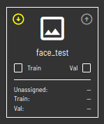

# Getting Started

This page provides info on how to use Web OTE tool. Before following these instructions please install required packages and build docker containers using [installation guide](README.md#installation).

# Table of contents

- [Data](#data)
    - [Data location](#data-location)
    - [Data annotation](#data-annotation-using-cvat)
    - [Dataset creation](#dataset-creation)
- [Object detection](#object-detection)
    - [Fine-tuning](#fine-tuning)
    - [Evaluation](#evaluation) 
- [Custom object detection](#custom-detection)   
- [Known issues](#known-issues-and-problems)

# Data

## Data Location
1. First of all, you should put the folder with pictures in `<training_extensions>/web/data/assets`. 
Please put at least 60 images for proper work.
2. After that choose the object detection task or create your own custom detection task with needed classes (for more information refer to [Custom detection section](#custom-detection)). 
3. Go to the `Assets` tab at the top of the screen there you will find your data.

**Important:** To avoid useless duplication please do not rename folders in the `Assets` folder.

## Data Annotation using CVAT
When you are able to observe your data folders in the `Assets` tab, you may send it to CVAT for annotation.
1. Press the `Push to CVAT` button at the top-right corner of each folder which you want to use in the training or evaluation. Please keep in mind that loading may take some time.
2. Press the folder icon to be redirected to the CVAT page with the annotation task and related information.
3. To start annotation press `Jobs` at the bottom of the page.

4. You may choose rectangles in the toolbar on the left to annotate bounding boxes or polygons to annotate more difficult shapes. To speed up the process use hot-keys like `N` to annotate a new shape or `F` to go to the next image. When the annotation is finished, don't forget to press the save button. 

**Useful tip** You may dump annotation and reuse it later. To do it choose `Actions` -> `Dump annotations` -> `CVAT 1.1` on the CVAT task page. 
Similarly, to upload annotation for the task choose `Action` -> `Upload annotation` and the type of annotations you have got. 

## Dataset Creation
1. As soon as you finished the annotation for all folders and corresponding jobs, return to the `Assets` tab and press the `Pull from CVAT` yellow button in the top-left corner of each folder icon.

2. Then classify each folder you want to use as `train` or `val` in order to use it for training or evaluation.
3. If every step was accomplished, the `Build` in the top-right corner of the page becomes active. Press it to create the dataset with selected images and train/val distribution.

This action will create a build (dataset) with the timestamp of creation as a name. Use it for fine-tuning and evaluation, choosing it from the drop-down list of builds in the top-right corner of the Info page for every Object detection task.

**Important** Please notice that for the proper fine-tuning both train and val parts should exist in the dataset. If you want to evaluate pre-trained models on your data, it is allowed to have only val part in the dataset.

**Important** Please keep in mind that if train or val part contains less than 60 images, it could not be created and used properly.

# Object detection
In the Info page for each object detection task you may observe its short description, table of pre-trained models with public accuracy and complexity and the graph with a comparison of the models to choose the most suitable for the specific task. 

## Evaluation
To evaluate pre-trained models on your dataset please do the following:
 1. Choose the timestamp of the needed build (dataset) in the drop-down list in the top-right corner of the page.
    
 2. Choose the model and press `Evaluate`.
 
## Fine-tuning
To achieve better results you may use your data to fine-tune pre-trained models for a specific class of objects. 
1. Choose the model and press `Fine-tune`.
2. Give a name to the model, select the needed build and the number of epochs. If you want to save val images with drawn predictions on it, select `Save annotated val images`. 
3. It is better to select advanced settings and tune the batch size. The higher batch size value helps to train a more general model and achieve better accuracy. However, too high value may provoke the memory problem: `ERROR: Unexpected bus error encountered in worker. This might be caused by insufficient shared memory (shm)`. 
You may conduct several attempts to choose the highest valid batch size or simply make it equal to 1.
4. Be ready that training will start with a little delay.
5. During the training you may monitor the progress with logs or Tensorboard graphs.

# Custom detection
If you did not find a suitable trained model for your task, you may create the Custom detection task. In this case, you will use models pre-trained on the great number of classes that are able to extract features from images. So, fine-tuning during several epochs will help you to train the model to detect specific or rare classes.  
1. Select `Create custom detection task` on the main page.
2. Fill all related information including classes you want to detect. 
3. Put your pictures in `<training_extensions>/web/data/assets` folder, annotate it and create a build.
4. Select a model from a list (more complex models are better for detecting small objects) and fine-tune it. Be ready that it may take more epochs than for standard object detection tasks to get good results.

# Known issues and problems 
1. Both train and val parts should contain at least 60 images for proper work.
2. Horizontal text detection model can be fine-tuned on GPU only.
